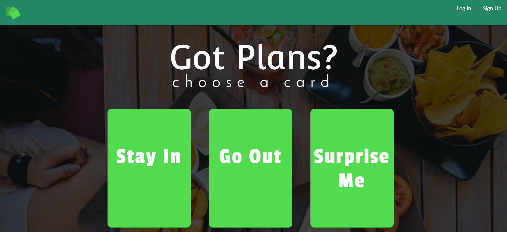
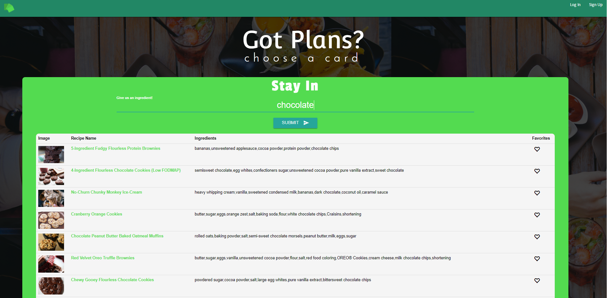
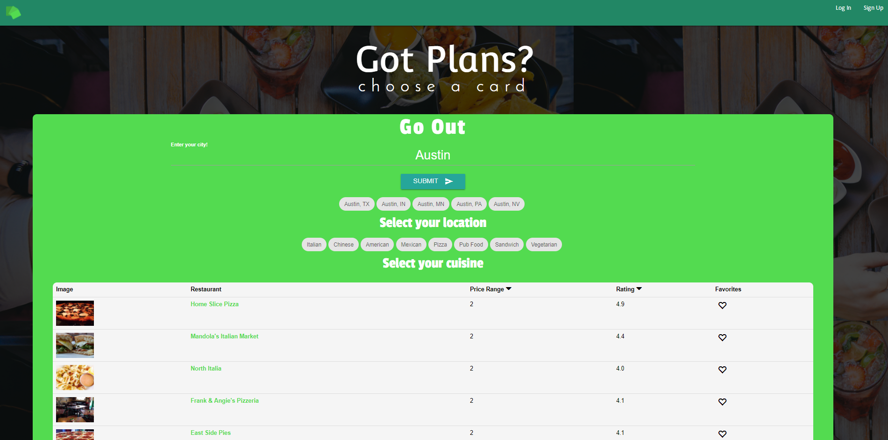
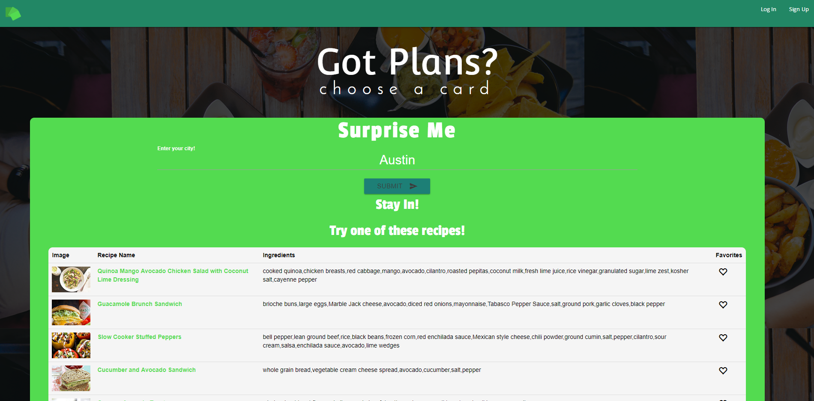
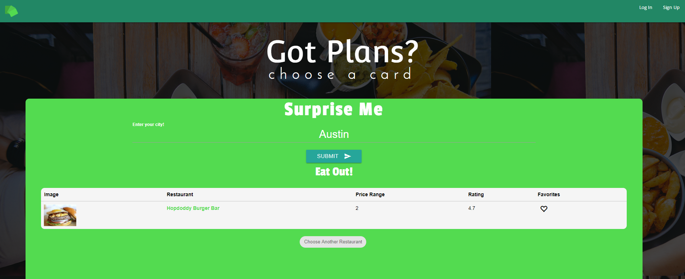
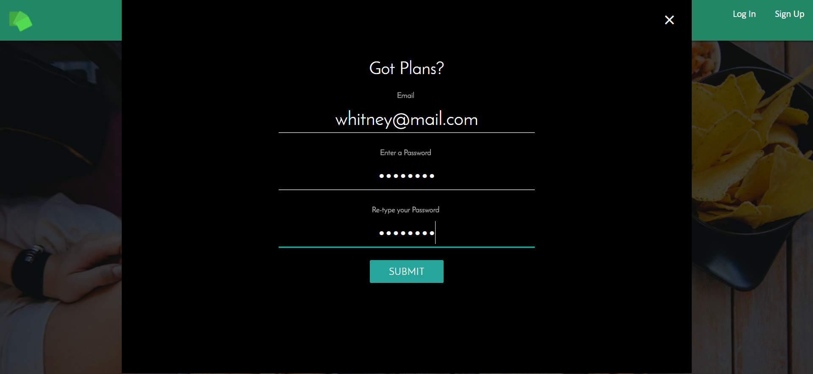
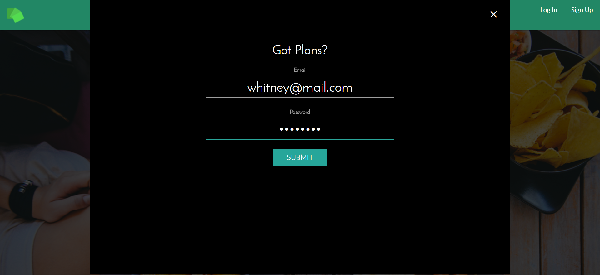
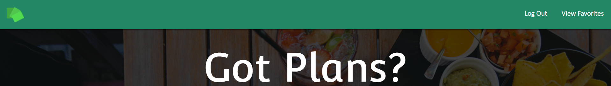
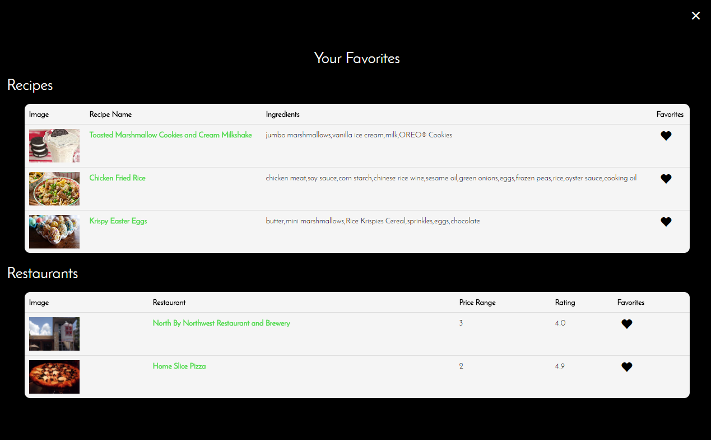

# Got Plans
Team project to build a food application that returns recipes and restaurant suggestions for users. The application has logic to choose a dine-in or dine-out suggestion for the indecisive user. The application makes AJAX requests to the Zomato API to return restaurant results and to the Yummly API to return recipe results. Features include user authentication with Firebase to allow users to access stored favorite recipes and restaurants for later site visits.

**Technology used:** AJAX, API, Firebase, Media Queries, jQuery, JavaScript, HTML, and CSS.

- - -

Below are screenshots demonstrating the application:
### Application Start

### Stay In Option
Enter a food item to find recipes that have that ingredient listed in it.

### Go Out Option
Enter a city and choose the correct location from the returned items. Select a cuisine option of interest to return a list of restaurants.

### Surprise Me Option - Stay In

### Surprise Me Option - Go Out

### Sign Up
Modal form to enter new user information.

### Log In 
Modal form to enter user credentials.

### Logged In
Once logged in, 'View Favorites' becomes available to the user.

### Favorites
Modal that shows the user his/her favorited items.
